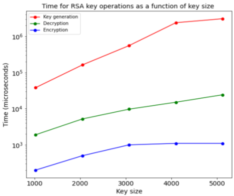

# RSA-Time-Analysis
## Problem
Our task was to analyze the time requirements for various RSA key operations such as key generation, encryption and decryption as a function of key size. 
## Solution Plan
We decided to use JAVA for the task, the plan is to use the inbuilt libraries in JAVA for key generation, encryption and decryption. For each of the operations we compute the time taken by it and finally plot graphs to compare the time requirements of key generation, encryption and decryption. 
## Work Done
*  We decided to use the Java KeyPairGenerator class present inside the java.security package to generate both public and private keys for RSA. 
* For encrypting and decrypting data we used the Cipher class inside the javax.crypto package.

For our analysis we performed all the 3 operations(key generation, encryption and decryption) with 5 different key sizes(1024, 2048, 3072, 4096, 5120 bits). For each key size we perform all the 3 operations for 10 times and finally calculate time taken for each operation to be the average over all runs. After repeating the process for each key size, we then plot the graph showing how the time taken varies for each of these operations as a function of key size, as shown below:

## Learnings
We have learned the relation between time requirements for RSA key operations - key generation, encryption and decryption. We found out that time taken for key generation is way higher than decryption and encryption operations, because it takes a lot of time to generate two large primes. Though decryption and encryption operations uses modular exponentiation which is polynomial in time, the time taken for decryption is higher than encryption, since the exponent part in decryption operation (private key ‘d’) is very large compared to exponent part in encryption operation (public key ‘e’).
